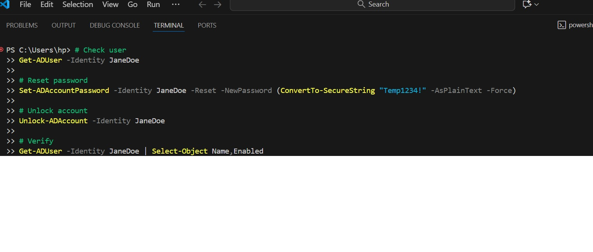

Ticket ID: INC-001
Reported by: Jane Doe (Marketing)
Issue Type: Account Access
Priority: Medium
Status: Resolved

Issue Description

User reported inability to log in to her workstation and email account after multiple failed login attempts. System displayed an account lockout message.

Troubleshooting Steps Taken
	1.	Verified user identity using internal verification process
	2.	Checked account status and confirmed account was locked
	3.	Reset user password according to company password policy
	4.	Forced password change at next login
	5.	Confirmed account was unlocked successfully

Resolution

Password was reset and the account unlocked. User was able to log in successfully and access email and internal tools without further issues.

Post-Resolution Notes
	•	Advised user to avoid repeated failed login attempts
	•	Recommended updating saved passwords on all devices
	•	No further action required

Skills Demonstrated
	•	User authentication support
	•	Account unlock and password reset
	•	Ticket documentation
	•	End-user communication
